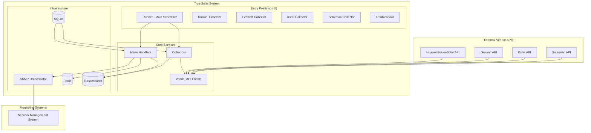
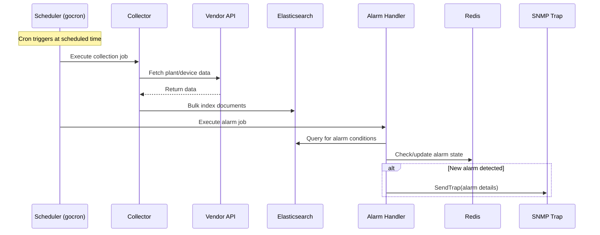
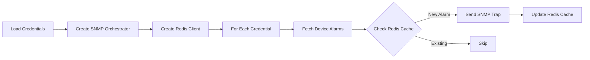

# True Solar - Software Documentation

> **Version:** 1.0  
> **Last Updated:** 2024-12-24  
> **Go Version:** 1.22.0  
> **Target Audience:** Maintenance Development Team

---

## Table of Contents

1. [Architecture Overview](#1-architecture-overview)
2. [Technical Specification](#2-technical-specification)
3. [Code Walkthrough](#3-code-walkthrough)
4. [Configuration Guide](#4-configuration-guide)
5. [Running the Application](#5-running-the-application)
6. [Troubleshooting & Maintenance](#6-troubleshooting--maintenance)

---

## 1. Architecture Overview

### 1.1 System Purpose

True Solar is a **solar power plant data collection and monitoring system** that aggregates data from multiple solar inverter vendors, stores it in Elasticsearch, and generates alarms via SNMP traps for monitoring systems.

### 1.2 High-Level Architecture



### 1.3 Data Flow



### 1.4 Component Responsibilities

| Component          | Responsibility                                             |
| ------------------ | ---------------------------------------------------------- |
| **Runner**         | Main scheduler orchestrating all collection and alarm jobs |
| **Collectors**     | Fetch data from vendor APIs and index to Elasticsearch     |
| **Alarm Handlers** | Detect alarm conditions and send SNMP traps                |
| **API Clients**    | HTTP clients for each vendor's API                         |
| **Infrastructure** | Database connections and SNMP communication                |
| **Troubleshoot**   | Historical data re-collection for data recovery            |

---

## 2. Technical Specification

### 2.1 Technology Stack

| Technology        | Version | Purpose                               |
| ----------------- | ------- | ------------------------------------- |
| **Go**            | 1.22.0  | Primary language                      |
| **Elasticsearch** | 7.x     | Time-series data storage              |
| **Redis**         | -       | Alarm state caching                   |
| **SQLite**        | -       | Credentials and configuration storage |
| **GORM**          | 1.25.x  | ORM for SQLite                        |
| **gocron**        | 1.37.x  | Job scheduling                        |
| **gosnmp**        | 1.39.x  | SNMP trap generation                  |
| **zerolog**       | 1.33.x  | Structured logging                    |

### 2.2 Project Structure

```
true-solar/
├── cmd/                    # Application entry points
│   ├── runner/             # Main scheduler (recommended)
│   ├── huawei/             # Standalone Huawei collector
│   ├── huawei2/            # Huawei v2 API collector
│   ├── growatt/            # Standalone Growatt collector
│   ├── kstar/              # Standalone Kstar collector
│   ├── solarman/           # Standalone Solarman collector
│   ├── alarm/              # Alarm processing
│   ├── performance/        # Performance alarm processing
│   ├── bulk/               # Bulk operations
│   ├── delete_doc/         # Document deletion utility
│   └── troubleshoot/       # Data recovery tool
├── api/                    # Vendor API clients
│   ├── huawei/             # Huawei FusionSolar API
│   ├── huawei2/            # Huawei v2 API
│   ├── growatt/            # Growatt OpenAPI
│   ├── kstar/              # Kstar API
│   └── solarman/           # Solarman API
├── collector/              # Data collection logic
│   ├── huawei.go
│   ├── huawei2.go
│   ├── growatt.go
│   ├── kstar.go
│   └── solarman.go
├── alarm/                  # Alarm detection and processing
│   ├── huawei.go
│   ├── growatt.go
│   ├── kstar.go
│   ├── solarman.go
│   ├── low_performance.go  # Performance threshold alarm
│   ├── sum_performance.go  # Aggregate performance alarm
│   └── clear.go            # Alarm clearing
├── model/                  # Data models
│   ├── elastic.go          # Elasticsearch document models
│   ├── credential.go       # Vendor credentials
│   ├── alarm.go            # Alarm models
│   └── ...
├── repo/                   # Repository layer
│   ├── solar.go            # Elasticsearch operations
│   ├── huawei_credential.go
│   ├── growatt_credential.go
│   ├── kstar_credential.go
│   ├── solarman_credential.go
│   └── ...
├── infra/                  # Infrastructure setup
│   ├── elastic.go          # Elasticsearch client
│   ├── redis.go            # Redis client
│   ├── gorm.go             # SQLite/GORM setup
│   └── snmp.go             # SNMP trap client
├── config/                 # Configuration
│   ├── config.go           # Config loading (Viper)
│   └── model.go            # Config struct definitions
├── pkg/                    # Shared utilities
│   ├── logger/             # Logging utilities
│   └── util/               # Helper functions
├── troubleshoot/           # Historical data recovery
├── scripts/                # Health check scripts
└── config.yaml             # Application configuration
```

### 2.3 Elasticsearch Indices

| Index Pattern          | Purpose                  | Data Type                        |
| ---------------------- | ------------------------ | -------------------------------- |
| `solarcell-YYYY.MM.DD` | Daily solar data         | PlantItem, DeviceItem, AlarmItem |
| `site-station`         | Site station master data | SiteItem                         |
| `alarm`                | Alarm records            | AlarmItem                        |
| `performance-alarm`    | Performance alarms       | SnmpPerformanceAlarmItem         |

### 2.4 Data Models

#### PlantItem (Solar Plant)
```go
type PlantItem struct {
    Timestamp         time.Time  // Collection timestamp
    VendorType        string     // HUAWEI, GROWATT, KSTAR, SOLARMAN
    DataType          string     // "PLANT"
    Area              string     // Geographic area
    SiteID            string     // Site identifier
    Name              *string    // Plant name
    InstalledCapacity *float64   // Capacity in kW
    CurrentPower      *float64   // Current power output
    DailyProduction   *float64   // Daily energy (kWh)
    MonthlyProduction *float64   // Monthly energy (kWh)
    YearlyProduction  *float64   // Yearly energy (kWh)
    TotalProduction   *float64   // Lifetime energy (kWh)
    PlantStatus       *string    // Online/Offline/Alarm
    Owner             string     // TRUE or ALTERVIM
}
```

#### DeviceItem (Inverter/Device)
```go
type DeviceItem struct {
    Timestamp            time.Time
    VendorType           string
    DataType             string     // "DEVICE"
    PlantID              *string
    SN                   *string    // Serial number
    DeviceType           *string    // Inverter type
    Status               *string    // Device status
    TotalPowerGeneration *float64
    DailyPowerGeneration *float64
}
```

#### AlarmItem
```go
type AlarmItem struct {
    Timestamp    time.Time
    VendorType   string
    DataType     string     // "ALARM"
    DeviceID     *string
    DeviceSN     *string
    Message      *string    // Alarm message
    AlarmTime    *time.Time
}
```

### 2.5 Vendor API Specifications

| Vendor       | Base URL              | Auth Method       | API Version |
| ------------ | --------------------- | ----------------- | ----------- |
| **Huawei**   | FusionSolar API       | Username/Password | v1, v2      |
| **Growatt**  | OpenAPI               | Token-based       | v1          |
| **Kstar**    | Kstar Cloud API       | MD5 Signature     | v1          |
| **Solarman** | Solarman Business API | SHA256 + Secret   | v1          |

### 2.6 SNMP Trap Configuration

SNMP traps are sent to monitoring systems with the following OIDs:

| OID                     | Description                                                 |
| ----------------------- | ----------------------------------------------------------- |
| `1.3.6.1.4.1.30378.2.1` | Component class                                             |
| `1.3.6.1.4.1.30378.2.2` | Device name                                                 |
| `1.3.6.1.4.1.30378.2.3` | Alert name                                                  |
| `1.3.6.1.4.1.30378.2.4` | Description                                                 |
| `1.3.6.1.4.1.30378.2.5` | Severity (0=Clear, 3=Warning, 4=Minor, 5=Major, 6=Critical) |
| `1.3.6.1.4.1.30378.2.6` | Last update time                                            |

---

## 3. Code Walkthrough

### 3.1 Main Entry Point: Runner

The **Runner** (`cmd/runner/main.go`) is the primary entry point that orchestrates all scheduled jobs.

```go
func main() {
    logger.Init("runner.log")
    
    // Set timezone to Asia/Bangkok
    loc, _ := time.LoadLocation("Asia/Bangkok")
    time.Local = loc

    // Create scheduler
    cron := gocron.NewScheduler(time.Local)
    
    // Register all vendor jobs
    registerJobs(cron)  // Includes: Growatt, Kstar, Huawei, Huawei2, Solarman, Performance
    
    // Start blocking (runs forever)
    cron.StartBlocking()
}
```

#### Job Registration Pattern

Each vendor has two jobs:
1. **Collect Job** - Fetches data from vendor API and indexes to Elasticsearch
2. **Alarm Job** - Checks for alarm conditions and sends SNMP traps

```go
func scheduleGrowattJobs(cron *gocron.Scheduler) error {
    cfg := config.GetConfig()
    
    // Collection job
    addCronJob(cron, cfg.Crontab.CollectTime, "growatt_collect", func() error {
        return runGrowattCollect(growattJobLogger)
    })
    
    // Alarm job
    addCronJob(cron, cfg.Crontab.AlarmTime, "growatt_alarm", func() error {
        return runGrowattAlarm(growattJobLogger)
    })
}
```

### 3.2 Collector Flow

Each collector follows this pattern:

```mermaid
flowchart LR
    A[Load Credentials] --> B[Create Vendor Client]
    B --> C[Fetch Plant List]
    C --> D[For Each Plant]
    D --> E[Fetch Plant Details]
    E --> F[Fetch Device List]
    F --> G[For Each Device]
    G --> H[Fetch Device Data]
    H --> I[Check Alarms]
    I --> J[Create Documents]
    J --> K[Bulk Index to ES]
```



#### Example: Growatt Collector

```go
func (g *GrowattCollector) Execute(now time.Time, credential *model.GrowattCredential) {
    // 1. Get site region mappings from SQLite
    siteRegions, _ := g.siteRegionRepo.GetSiteRegionMappings()
    
    // 2. Create API client
    client := growatt.NewGrowattClient(credential.Username, credential.Token)
    
    // 3. Fetch plant list
    plantList, _ := client.GetPlantList()
    
    // 4. Process each plant concurrently
    wg := conc.NewWaitGroup()
    for _, station := range plantList {
        wg.Go(func() {
            // Fetch plant details, devices, and alarms
            // Create PlantItem, DeviceItem, AlarmItem documents
            docCh <- plantItem
            docCh <- deviceItem
        })
    }
    wg.Wait()
    
    // 5. Bulk index to Elasticsearch
    collectorIndex := fmt.Sprintf("solarcell-%s", time.Now().Format("2006.01.02"))
    g.solarRepo.BulkIndex(collectorIndex, documents)
}
```

### 3.3 Alarm Handler Flow



#### Example: Alarm Handler

```go
func (a *GrowattAlarm) Run(credential *model.GrowattCredential) {
    client := growatt.NewGrowattClient(credential.Username, credential.Token)
    
    // Fetch plants and devices
    plantList, _ := client.GetPlantList()
    
    for _, plant := range plantList {
        deviceList, _ := client.GetPlantDeviceList(plant.PlantID)
        
        for _, device := range deviceList {
            // Check for alarms based on device status
            if device.Status != "online" {
                // Check Redis for existing alarm
                key := fmt.Sprintf("alarm:%s:%s", credential.Username, device.SN)
                if !a.redis.Exists(key) {
                    // Send SNMP trap
                    a.snmp.SendTrap(
                        device.Name,     // Device name
                        alarmName,       // Alert type
                        description,     // Description
                        severity,        // 0-6
                        time.Now().String(),
                    )
                    
                    // Cache in Redis
                    a.redis.Set(key, "1", 24*time.Hour)
                }
            }
        }
    }
}
```

### 3.4 Performance Alarm System

Two types of performance alarms monitor energy production:

#### Low Performance Alarm
Detects individual sites with production below threshold over a specified period.

```go
func (l *LowPerformanceAlarm) Run() error {
    // Get configuration from database
    config, _ := l.configRepo.GetByName("PerformanceLow")
    
    // Query Elasticsearch for underperforming sites
    results, _ := l.solarRepo.GetPerformanceLow(
        config.Duration,          // e.g., 7 days
        config.EfficiencyFactor,
        config.FocusHour,
        config.ThresholdPct,      // e.g., 60%
    )
    
    // Send SNMP traps for each underperforming site
    for _, result := range results {
        l.snmp.SendTrap(...)
    }
}
```

#### Sum Performance Alarm
Aggregates production across all sites and alerts if below threshold.

### 3.5 Repository Layer

The repository layer abstracts database operations:

```go
type SolarRepo interface {
    BulkIndex(index string, docs []interface{}) error
    UpsertSiteStation(docs []model.SiteItem) error
    GetPerformanceLow(duration int, efficiencyFactor float64, focusHour int, thresholdPct float64) ([]*elastic.AggregationBucketCompositeItem, error)
    GetSumPerformanceLow(duration int) ([]*elastic.AggregationBucketCompositeItem, error)
    GetUniquePlantByIndex(index string) ([]*elastic.AggregationBucketKeyItem, error)
    GetPerformanceAlarm(index string) ([]*model.SnmpPerformanceAlarmItem, error)
}
```

### 3.6 Infrastructure Layer

#### Elasticsearch Client

```go
// Connection pool configuration
const (
    ESMaxIdleConns        = 100
    ESMaxIdleConnsPerHost = 10
    ESMaxConnsPerHost     = 100
    ESIdleConnTimeout     = 90 * time.Second
)

var ElasticClient *elastic.Client

func init() {
    ElasticClient, _ = NewElasticClient()
}
```

#### SNMP Orchestrator

```go
type SnmpOrchestrator struct {
    clients  []*SnmpClient
    trapType TrapType
}

func (s *SnmpOrchestrator) SendTrap(deviceName, alertName, description, severity, lastUpdateTime string) {
    for _, client := range s.clients {
        client.SendTrap(deviceName, alertName, description, severity, lastUpdateTime)
    }
}
```

---

## 4. Configuration Guide

### 4.1 Configuration File (config.yaml)

```yaml
elasticsearch:
  host: "http://localhost:9200"
  username: "elastic"
  password: "password"

redis:
  host: "localhost"
  port: "6379"
  username: ""
  password: ""
  db: 0

snmp_list:
  - agent_host: "192.168.1.100"
    target_host: "192.168.1.200"
    target_port: 162

crontab:
  collect_time: "0 8 * * *"           # 8:00 AM daily
  alarm_time: "30 8 * * *"            # 8:30 AM daily
  low_performance_alarm_time: "0 9 * * *"   # 9:00 AM daily
  sum_performance_alarm_time: "30 9 * * *"  # 9:30 AM daily
```

### 4.2 Environment Variables

Configuration can be overridden via environment variables:

| Environment Variable     | Config Path            |
| ------------------------ | ---------------------- |
| `ELASTICSEARCH_HOST`     | elasticsearch.host     |
| `ELASTICSEARCH_USERNAME` | elasticsearch.username |
| `ELASTICSEARCH_PASSWORD` | elasticsearch.password |
| `REDIS_HOST`             | redis.host             |
| `REDIS_PORT`             | redis.port             |

### 4.3 Database Setup (SQLite)

Credentials are stored in SQLite database (`database.db`). Tables include:

- `huawei_credentials` - Huawei account credentials
- `growatt_credentials` - Growatt account credentials  
- `kstar_credentials` - Kstar account credentials
- `solarman_credentials` - Solarman account credentials
- `site_region_mappings` - Site to region mappings
- `installed_capacities` - Plant capacity data
- `performance_alarm_configs` - Performance alarm thresholds

---

## 5. Running the Application

### 5.1 Prerequisites

- Go 1.22+
- Elasticsearch 7.x
- Redis
- SQLite

### 5.2 Build Commands

```bash
# Build the main runner (all vendors)
go build -o runner ./cmd/runner/main.go

# Build individual vendor collectors
make huawei2
make growatt
make kstar
make solarman

# Build troubleshoot tool
make tbshoot
```

### 5.3 Running

```bash
# Run the main scheduler
./runner

# Run individual collector (standalone mode)
./cmd/huawei/main.go
./cmd/growatt/main.go
```

### 5.4 Health Check Scripts

Health check scripts are available in `/scripts/`:

```bash
# Check Huawei API connectivity
./scripts/huawei_healthcheck.sh -u username -p password

# Check Growatt API connectivity
./scripts/growatt_healthcheck.sh -u username -t token

# Check Kstar API connectivity
./scripts/kstar_healthcheck.sh -u username -p password -a appid -s secret

# Check Solarman API connectivity
./scripts/solarman_healthcheck.sh -u username -p password -a appid -s secret
```

---

## 6. Troubleshooting & Maintenance

### 6.1 Log Files

Logs are stored in the `logs/` directory:

| Log File                | Description                      |
| ----------------------- | -------------------------------- |
| `runner.log`            | Main scheduler logs              |
| `huawei.log`            | Huawei job logs                  |
| `growatt.log`           | Growatt job logs                 |
| `kstar.log`             | Kstar job logs                   |
| `solarman.log`          | Solarman job logs                |
| `performance_alarm.log` | Performance alarm logs           |
| `snmp.log`              | SNMP trap logs                   |
| `*_collector.log`       | Collector-specific detailed logs |

### 6.2 Troubleshoot Module

For historical data recovery, use the troubleshoot module:

```bash
# Build troubleshoot tool
make tbshoot

# Run to re-collect historical data
./tbshoot
```

The troubleshoot module can:
- Re-fetch data for a specific date range
- Re-index documents to Elasticsearch
- Handle data gaps from API failures

### 6.3 Common Issues

#### Issue: Elasticsearch Connection Failure
```
Error: failed to initialize elasticsearch client
```
**Solution:** Check `config.yaml` elasticsearch settings and network connectivity.

#### Issue: Vendor API Timeout
```
Error: context deadline exceeded
```
**Solution:** 
- Check vendor API status
- Verify credentials in database
- Check network connectivity

#### Issue: SNMP Traps Not Received
```
Error: failed to send trap
```
**Solution:**
- Verify SNMP target host/port configuration
- Check firewall rules for UDP port 162
- Verify SNMP community string

### 6.4 Adding New Vendor

To add a new vendor:

1. Create API client in `api/<vendor>/`
2. Create collector in `collector/<vendor>.go`
3. Create alarm handler in `alarm/<vendor>.go`
4. Add credential model in `model/credential.go`
5. Add credential repository in `repo/<vendor>_credential.go`
6. Register jobs in `cmd/runner/main.go`

### 6.5 Performance Tuning

| Setting                       | Description           | Default |
| ----------------------------- | --------------------- | ------- |
| Elasticsearch connection pool | Max connections       | 100     |
| Elasticsearch idle timeout    | Connection reuse      | 90s     |
| SNMP batch size               | Alarms per batch      | 25      |
| SNMP batch delay              | Delay between batches | 5s      |
| Low performance retry         | Max retries           | 5       |
| Low performance retry delay   | Delay between retries | 5min    |

---

## Appendix

### A. Vendor-Specific Notes

#### Huawei FusionSolar
- Two versions supported (v1 and v2)
- Session-based authentication
- Rate limiting applies

#### Growatt
- Token-based authentication
- Multiple device types: Inverter, Mix, SPA, Min, Pcs, Hps, Pbd
- Historical data endpoints available

#### Kstar
- MD5 signature-based authentication
- Requires appid and secret

#### Solarman
- SHA256 password hashing
- OAuth-style token authentication
- Supports historical data queries

### B. Owners

The system supports two owners:
- **TRUE** - TRUE Corporation plants
- **ALTERVIM** - Altervim plants

---

*Document generated for maintenance team handover. For questions, contact the original development team.*
